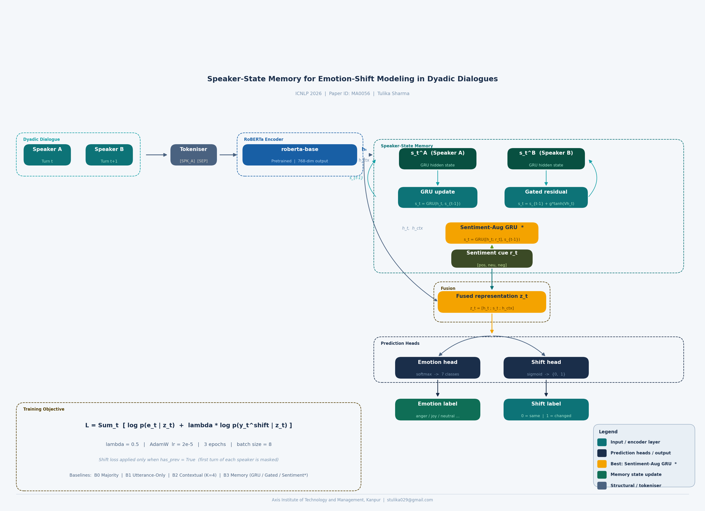

# Speaker-State Memory for Emotion-Shift Modeling in Dyadic Dialogues

[](.)
[](.)
[](LICENSE)
[](https://huggingface.co/datasets/daily_dialog)

> **ICNLP 2026 · Paper ID: MA0056**  
> *Tulika Sharma · Axis Institute of Technology and Management, Kanpur, India*

---

## Overview

Most conversational emotion models classify utterances in isolation. This work asks a different question: **can a model that remembers each speaker's emotional history detect when their emotion changes?**

We introduce a **speaker-state memory** — a recurrent, speaker-specific latent vector updated at every turn — and show that augmenting it with lightweight sentiment cues yields the best emotion-shift detection on DailyDialog.

<p align="center">
  
</p>

**Key results on DailyDialog:**

| Model | Emotion F1 | Shift F1 | AUPRC |
|---|---|---|---|
| B0 Majority | 0.1305 | 0.0000 | 0.0000 |
| B1 Utterance-Only (RoBERTa) | 0.3163 | 0.2061 | 0.3095 |
| B2 Contextual (K=4) | 0.2438 | 0.1059 | 0.3083 |
| B3 Memory-GRU | 0.1972 | 0.0937 | 0.3235 |
| B3 Memory-Gated | 0.1735 | 0.0000 | 0.3287 |
| B3 GRU-Trunc5 | 0.2004 | 0.0750 | 0.3344 |
| **B3 GRU-Sentiment ★** | **0.2073** | **0.2576** | **0.3073** |

> ★ Best model: Shift F1 improves **30% relatively** (0.20 → 0.26) over the best non-memory baseline.

---

## Key Contributions

1. **Formal problem definition** for dyadic emotion-shift modeling as a temporal probabilistic process.
2. **Speaker-state memory architecture** — recurrent, per-speaker latent states integrated with pretrained RoBERTa encoders.
3. **Three memory update variants**: GRU, Gated Residual, and Sentiment-Augmented GRU.
4. **Empirical evidence** that explicit state tracking improves shift detection, with diagnostic analyses across dialogue length, turn position, and speaker asymmetry.

---

## Repository Structure

```
emotion-shift-modeling/
│
├── EmotionShift.ipynb          # Main experiment notebook (Google Colab ready)
│
├── src/
│   ├── dataset.py              # DailyDialog loading, parsing, Dataset class
│   ├── models.py               # All model classes (B0–B3, GRU/Gated/Sentiment)
│   ├── train.py                # ExperimentRunner: training & evaluation loops
│   ├── analyze.py              # ExperimentAnalyzer: metrics, plots, ablation tables
│   └── utils.py                # ColabExperimentSaver, collate functions, helpers
│
├── assets/
│   └── pipeline.png            # Model architecture figure (from paper)
│
├── requirements.txt            # Python dependencies
├── LICENSE                     # MIT License
└── README.md                   # This file
```

---

## Setup

### 1. Clone the repository

```bash
git clone https://github.com/stulika029/emotion-shift-modeling.git
cd emotion-shift-modeling
```

### 2. Install dependencies

```bash
pip install -r requirements.txt
```

### 3. Download DailyDialog

The dataset is available on Kaggle:

```python
import opendatasets as od
od.download("https://www.kaggle.com/datasets/thedevastator/dailydialog-unlock-the-conversation-potential-in")
```

Or from Hugging Face:
```python
from datasets import load_dataset
dataset = load_dataset("daily_dialog")
```

Update `DATA_DIR` in the notebook / `src/dataset.py` to point to the downloaded CSV files.

---

## Usage

### Option A — Google Colab (recommended)

Open `EmotionShift.ipynb` directly in [Google Colab](https://colab.research.google.com/). The notebook is self-contained: it installs dependencies, downloads data, and runs all experiments end-to-end.

### Option B — Run from source

```python
from src.dataset import DailyDialogLocalDataset, collate_fn_b3
from src.models import GRUMemoryWithSentimentModel
from src.train import EnhancedExperimentRunner
from torch.utils.data import DataLoader
from transformers import RobertaTokenizer
import torch

# Setup
device = torch.device('cuda' if torch.cuda.is_available() else 'cpu')
tokenizer = RobertaTokenizer.from_pretrained('roberta-base')
tokenizer.add_special_tokens({'additional_special_tokens': ['[SPK_A]', '[SPK_B]', '[SEP]']})

DATA_DIR = "path/to/dailydialog"

# Load datasets
train_ds = DailyDialogLocalDataset(DATA_DIR, split="train", k_context=4)
val_ds   = DailyDialogLocalDataset(DATA_DIR, split="validation", k_context=4)
test_ds  = DailyDialogLocalDataset(DATA_DIR, split="test", k_context=4)

# Dataloaders
train_loader = DataLoader(train_ds, batch_size=8, shuffle=True,
                          collate_fn=lambda x: collate_fn_b3(x, tokenizer))
val_loader   = DataLoader(val_ds, batch_size=8, shuffle=False,
                          collate_fn=lambda x: collate_fn_b3(x, tokenizer))
test_loader  = DataLoader(test_ds, batch_size=8, shuffle=False,
                          collate_fn=lambda x: collate_fn_b3(x, tokenizer))

# Model
model = GRUMemoryWithSentimentModel(lambda_shift=0.5, memory_dim=128)
model.roberta.resize_token_embeddings(len(tokenizer))

# Train & evaluate
runner = EnhancedExperimentRunner(model, train_loader, val_loader, test_loader, device)
results = runner.run_enhanced_experiment(num_epochs=3, model_name="B3_GRU_Sentiment")

print(f"Test Shift F1: {results['test_metrics']['shift_f1']:.4f}")
print(f"Test AUPRC:    {results['test_metrics']['shift_auprc']:.4f}")
```

---

## Models

### B0 — Majority Baseline
Always predicts the most common emotion (neutral) and no shift.

### B1 — Utterance-Only (RoBERTa)
Encodes only the current utterance with `roberta-base`. Two heads: 7-way softmax for emotion, sigmoid for shift.

### B2 — Contextual (RoBERTa + K=4)
Concatenates the last 4 turns with `[SPK_A]`/`[SPK_B]` tags and encodes jointly.

### B3 — Speaker-State Memory
At each turn, the RoBERTa representation updates a speaker-specific latent state:

**GRU update:**
```
s_t^i = GRU(h_t, s_{t-1}^i)
```

**Gated Residual update:**
```
s_t^i = s_{t-1}^i + σ(W·[h_t; s_{t-1}^i]) ⊙ tanh(V·h_t)
```

**Sentiment-Augmented GRU (best):**
```
s_t^i = GRU([h_t; r_t], s_{t-1}^i)   # r_t = sentiment feature vector
```

The fused representation `z_t = [h_t; s_t; h_ctx]` feeds both prediction heads. Loss:

```
L = Σ_t [ log p(e_t | z_t) + λ · log p(y_t^shift | z_t) ]
```

---

## Diagnostic Findings

| Analysis | Finding |
|---|---|
| Per-class F1 | Neutral (0.91) and happiness (0.38) dominate; fear and disgust near zero |
| Shift calibration | Moderate reliability; slight overconfidence for rare shifts |
| Dialogue length | Performance degrades on longer dialogues (error accumulation) |
| Turn position | Early/mid turns predicted more accurately than late turns |
| Speaker asymmetry | Speaker B slightly harder to model than Speaker A |

---

## Limitations & Future Work

- **Dataset scope**: DailyDialog is clean and neutral-dominant; results may not transfer to naturalistic or multi-party conversations.
- **Binary shift**: The shift indicator cannot capture gradual multi-turn affective drift.
- **Future directions**: Multimodal input (prosody, facial expressions), hierarchical dialogue contexts, and richer affective continuity representations beyond discrete labels.

---

## Citation

If you use this code or build on this work, please cite:

```bibtex
@inproceedings{sharma2026speakerstate,
  title     = {Speaker-State Memory for Emotion-Shift Modeling in Dyadic Dialogues},
  author    = {Sharma, Tulika},
  booktitle = {Proceedings of the International Conference on Natural Language Processing (ICNLP)},
  year      = {2026},
  note      = {Paper ID: MA0056}
}
```

---

## References

- Li et al. (2017). DailyDialog: A Manually Labelled Multi-Turn Dialogue Dataset. *IJCNLP*.
- Majumder et al. (2018). DialogueRNN: An Attentive RNN for Emotion Detection in Conversations. *arXiv:1811.00405*.
- Ghosal et al. (2020). COSMIC: Commonsense Knowledge for Emotion Identification. *EMNLP Findings*.
- Dai et al. (2019). Transformer-XL: Attentive Language Models Beyond a Fixed-Length Context. *arXiv:1901.02860*.

---

## Contact

**Tulika Sharma** · stulika029@gmail.com  
Axis Institute of Technology and Management, Kanpur, India

*Questions, issues, and pull requests are welcome.*

---

## Disclaimer
This repository and its assets, including the PNG files, were created with the assistance of an AI model, Anthropic's Claude